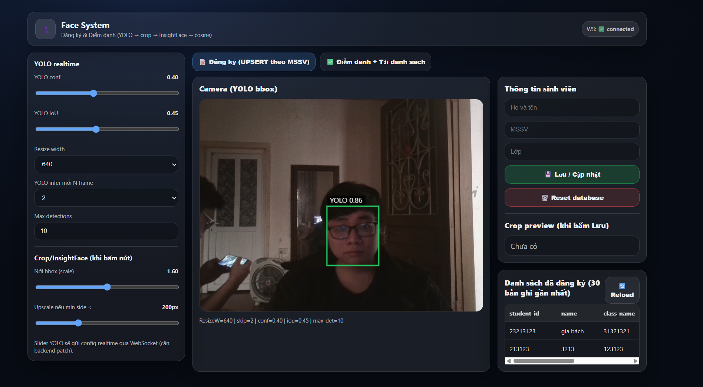
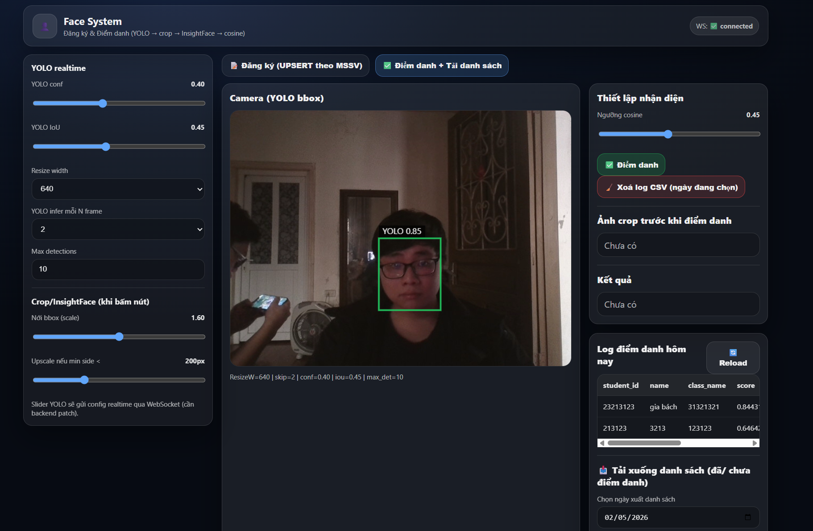
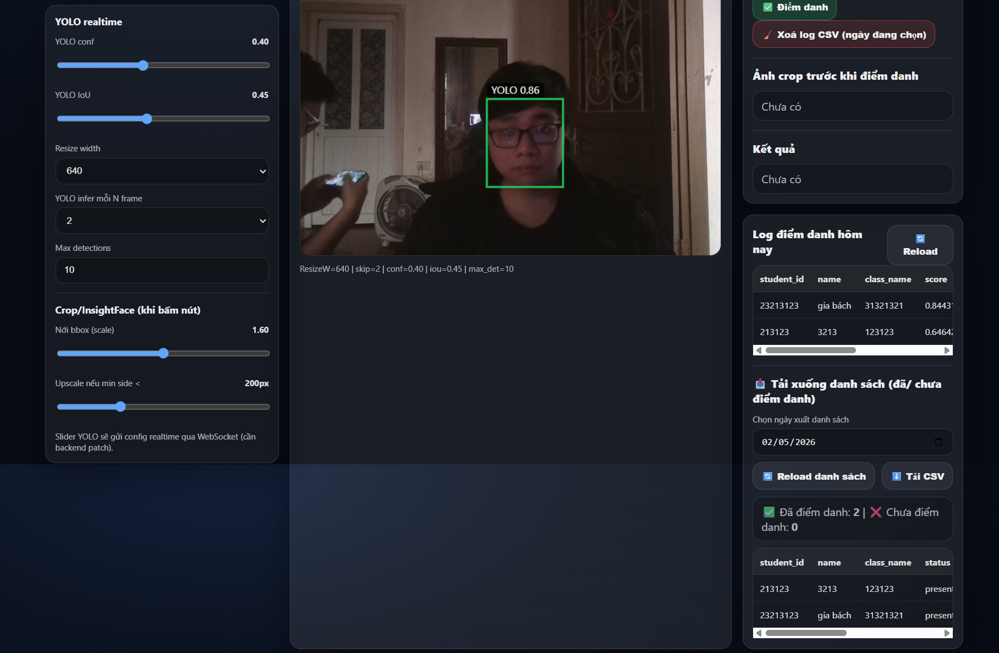
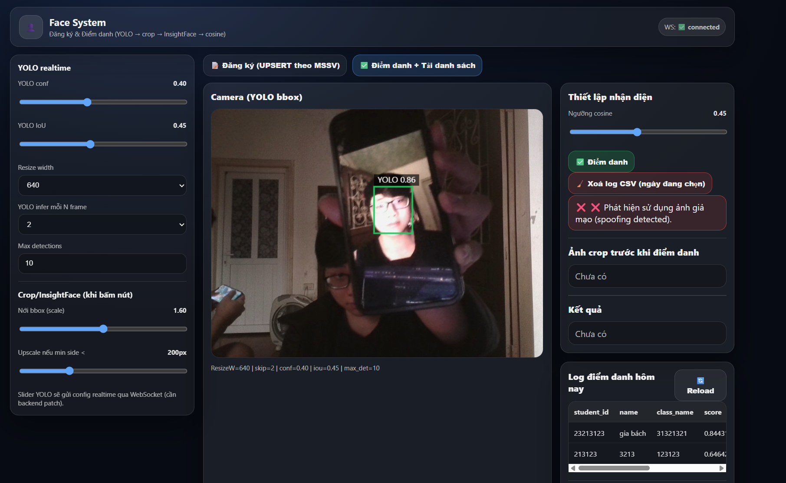
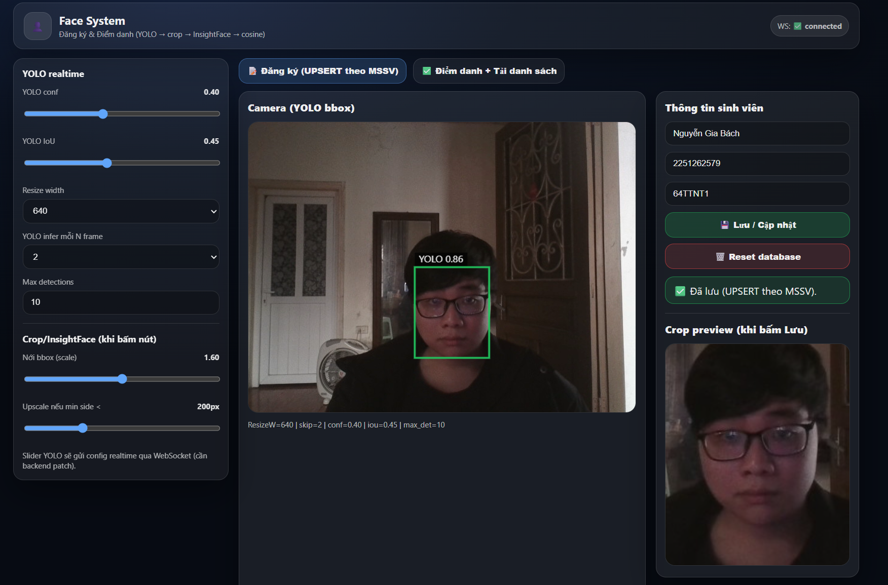
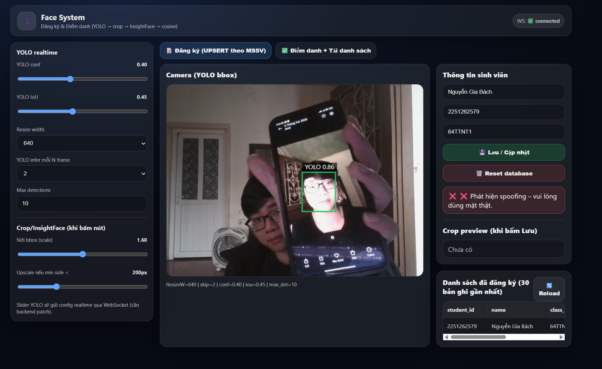
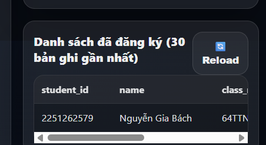
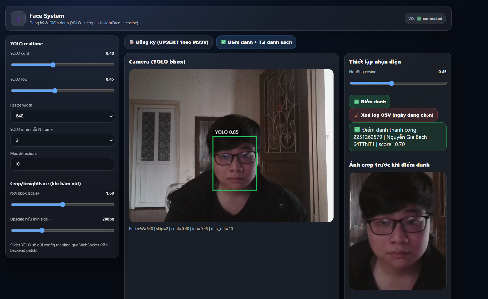
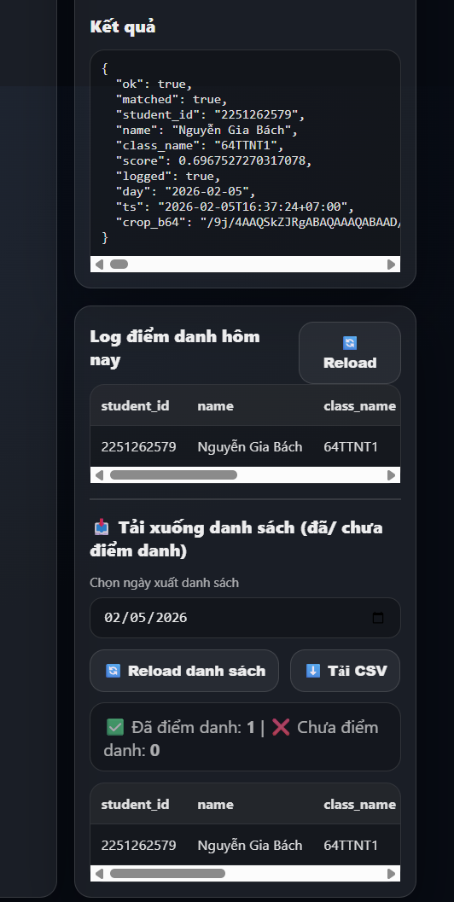
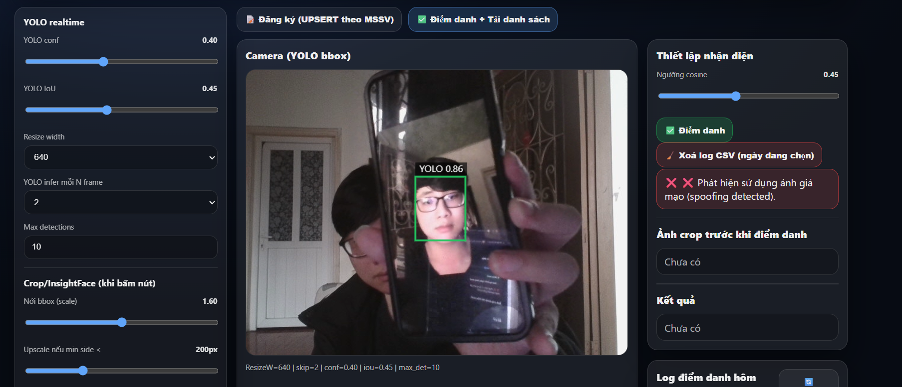

# Automated-face-recognition-based-attendance-system.

## Description
- **The Automated Face Recognition Based Attendance System is a computer-vision-based application that automatically marks attendance by identifying individuals through facial recognition. This system eliminates manual attendance, reduces proxy attendance, and improves accuracy and efficiency using deep learning and image processing techniques**

## This project divede into Two parts:

### Face registration:
- **The Face Registration module is responsible for enrolling new users into the system. During registration, facial images of an individual are captured through a camera and stored in the dataset (after embedding) with a unique ID, name and class. These embeddings are later used future reference.**

### Attendance Marking:
- **For attendance marking, the system captures the face through the camera, extracts the embedding, and compares it with the stored embeddings. If a match is found, the person is identified and attendance is marked automatically.**


## Features
- **Face Registration: Captures a user’s face through the camera, extracts embeddings, and stores them in the dataset.**
- **Attendance Marking: Identifies registered users in real time and marks attendance automatically.**
- **Anti-Spoofing: Prevents fake attendance using photos, videos, or other spoofing attempts.**
- **CSV Storage: Saves attendance records in a CSV file with name, ID, and class details.**

## Sample
### Face registration


### Attendance Marking:



### Anti-Spoofing



## Dataset
## Dataset
### Face detection and Face Recognition
**The RetenaFace model for face detection use the wider_face dataset to train.**
**Dataset : https://drive.google.com/file/d/11UGV3nbVv1x9IC--_tK3Uxf7hA6rlbsS/view**

```
data/
└── widerface/
    ├── train/
    │   ├── images/
    │   └── label.txt
    └── val/
        ├── images/
        └── wider_val.txt
```

**wider_val.txt only includes val file names but not label information.**

## Tech stark 

### frontend
- **ReactJS - used to build an interactive and responsive user interface for managing face registration, attendance viewing, and system interactions.**

### Backend

- **FastAPI – High-performance async API framework**
- **Uvicorn (expected) – ASGI server**
- **CORS Middleware – Secure cross-origin access**

### Machine Learning & Deep Learning
#### Frameworks
- **PyTorch – Primary deep learning framework**
- **TorchVision – Image preprocessing & pretrained models**
- **TensorFlow (optional) – Disabled OneDNN optimizations for compatibility**
- **Modeling & Vision**
- **HuggingFace Transformers**
- **OpenCV (cv2) – Image decoding & processing**
- **Pillow (PIL) – Image manipulation**
- **YOLOv12n (Face Detection): A lightweight and fast deep-learning model used to accurately detect human faces in real time from camera input.**
- **DeepFace (Anti-Spoofing): Used to detect spoofing attempts such as photos or videos by analyzing facial texture and liveness features.**
- **InsightFace (Face Embedding): Generates highly discriminative facial embeddings that represent unique facial features for accurate face recognition and matching.**


### Custom modules include:
- **db_connect, now_vn, init_db**
- **to_jpg_bytes, img_to_b64_jpg, l2_normalize**
- **upsert_student, insert_attendance_if_new_day**
- **load_embeddings, get_attendance_summary, rows_to_csv_bytes**
- **decode_jpg_bytes, clamp_bbox, expand_bbox, upscale_if_small, pick_best_yolo_box.**
- **pick_best_yolo_box.**

### Data & Utilities
- **Pandas – Dataset loading and manipulation**
- **NumPy – Numerical computing**
- **Pathlib / OS / Shutil – File management**
- **TQDM – Progress visualization**
- **Base64 – Image encoding**
- **Argparse – CLI handling**
- **SimpleNamespace – Lightweight configuration wrappers**
- **SQLite - a lightweight local database to store user details and attendance records efficiently without requiring a separate database server.**

### System Integration
- **sqlite index loading/saving**
- **Docker - used to containerize the entire face recognition attendance system, ensuring a consistent runtime environment, easy deployment, and smooth execution across different machines without dependency conflicts.**


## Installation
```
git clone https://github.com/b2004x/Automated-face-recognition-based-attendance-system

```

## Model Details

### Face Registration 

**This system divided in to two part:**

#### Face Capture and Preprocessing
- **The first part is face capture, where the system uses a camera to acquire live video frames of the user.**
- **From each frame, the face region is detected using a face detection model (YoloV12n) and accurately cropped.**
- **The cropped face images are preprocessed by resizing and normalization to ensure uniform input quality.**
- **After that it run through a anti-spoofing model(deepface) to detect whether is a real face or an image/video.**
- **Multiple face samples are collected to improve robustness and recognition accuracy.**

#### Embedding Extraction and Storage
- **The second part is embedding generation, where distinctive facial features are extracted from the processed face crop.**
- **Each face is converted into a fixed-length numerical embedding that uniquely represents the individual.**
- **The generated embeddings are associated with user metadata such as name, ID, and class.**
- **All embeddings and related metadata are stored in the dataset or database for future face recognition and attendance marking.**







### Attendance Marking

**This system also divided in to two part:**

#### Face Detection and Recognition

- **The first part is face detection, where the system captures live video through a camera during attendance time.** 
- **Detected faces are cropped using YoloV12n and preprocessed to maintain consistency with registered data.**
- **The croped face going through anti-spoofing model(deepface) to detect cheating in attendance (using image/video instead of real person).**
- **Facial embeddings are generated from the captured faces using the same embedding model.**
- **The generated embeddings are compared with stored embeddings to identify the individual.**


#### Attendance Recording

- **The second part is attendance recording, where a successful match confirms the identity of the user.** 
- **Attendance is marked only once per session to avoid duplicate entries.**
- **The system records attendance details including name, ID, class, date, and time.**
- **All attendance records are saved securely in a CSV file or database for future reference.**









## Model evaluation

## Model Performance 
### Face Detection

- **Epoch: 100/100 | Batch: 400/400 | Loss Localization : 0.5011 | Classification: 0.8221 | Landmarks: 0.7289 | LR: 0.00001000 | Time: 1.5069 s**
- **Average batch loss: 2.5618900**

- **This is the results of the final batch in the final eppoch.**


## Instruction how to use the repo
- **Working directory is FACE_DETECTION**
- **After cloning the repository**
- **Activate backend**
```
cd demo-4/backend
uvicorn api:main --reload
```
- **Open front-end in another terminal**

```
cd demo-4/frontend
npm run dev
```

### Or you can use docker with this terminal

```
cd demo-4
docker compuse build --no-cache
docker compuse up
```

## Front-end
- **First tab for Face Registration**


- **Second tab Attendence Marking**


## Referance
- **https://github.com/deepinsight/insightface**
- **https://github.com/akanametov/yolo-face**
- **https://github.com/serengil/deepface**
- **https://github.com/serengil/retinaface**